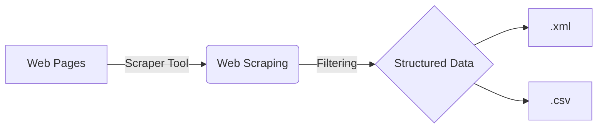

# Bosphorus Web 

 Bu proje, web scraping tekniği kullanarak web sitelerinden halka açık verileri kazıma ve işleme yöntemlerini uygulayarak bilgi yayılımının özgürleştirilmesini amaçlamaktadır.

## Web Scraping(Web Kazıma) Nedir?

Web Scraping, özel bir yazılım aracılığıyla web sitelerinden veri toplayarak son kullanıcıya ulaştıran program tekniğidir.

> ### _Akış Diyagramı:_

> ### _UML Sınıf Diyagramı:_

_Daha fazla bilgi için ziyaret edebilirsiniz: [Vikipedi/Web Scraping](https://tr.wikipedia.org/wiki/Web_kaz%C4%B1ma)._

## Yasal Durumlar

Web Scraping ile ilgili mevcut durumda herhangi bir yasal düzenleme veya kanun bulunmamaktadır. Çoğu yeni girişim, herhangi bir ortaklık gerektirmediğinden ve ucuz olduğundan dolayı veri toplamak için bu yöntemi kullanmaktadır.

_Daha fazla bilgi için ziyaret edebilirsiniz: [Legality and Ethics of Web Scraping](https://www.researchgate.net/publication/352014123_Legality_and_Ethics_of_Web_Scraping)._

### Proje Görev Listesi:
> 1.Hafta:
>>- [x] Proje Akış Şeması:
>>  - [x]  Visual Studio Code
 >> - [x]  Mermaid ve PlantUml Eklentileri ([docs](https://mermaid-js.github.io/mermaid/#/)) ([docs](https://plantuml.com/))

> 2.Hafta:  
>>- [x] Proje Genel Durum Diyagramlarını Oluşturmak
  >>- [x] Usecase Diyagramı
  >>- [x] UML Diyagramı

> 3.Hafta:
>>- [x] Gerekli Yazılımların Kurulması:
  >>- [x]  Jetbrains WebStorm Uygulaması 
  >>- [x]  Node.js Uygulaması
  >>- [x]  Google Chrome:
   >>- [x]  Chrome Json Viewer Eklentisinin kurulması

> 4.Hafta:
>>- [x] package.json Dosyasının Oluşturulması:
  >>- [x] name
  >>- [x] version
  >>- [x] main 
  >>- [x] license

> 5. Hafta:
>>- [x] Node.js Dependencies ve Paketleri:
  >>- [x] npm axios
  >>- [x] npm cheerio
  >>- [x] npm express

> 6.Hafta
>>- [x] index.js dosyası: 
 >> - [x]  localhost ve port tanımlama
  >>- [x]  npm nesnelerinden require objeleri oluşturma
  >>- [x]  fonksiyon tanımlama
  >>- [x]  server url slug data gruplandırma
  >>- [x]  spesifik bilgiyi almak için data filtreleme

> 7.Hafta:
>>- [x]  Filtrelenen veriyi extract etme ve yapılandırma

> 8.Hafta:
>>- [ ]  Yapılandırılmış veriyi okunabilir hale getirme(.xml/.csv)

## Proje Takım:

1. Mehmet Kesimalioğlu
   - _İSTE Bilgisayar Mühendisliği_
     - 202503211

